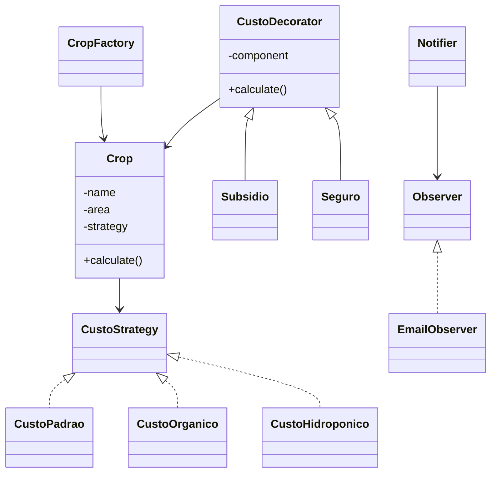

# Sistema de Produção Agrícola  
**Desenvolvido por:** Andrei Cardozo (andrei.cardozo@unidavi.edu.br)

Este projeto simula o planejamento de produção agrícola utilizando quatro padrões de projeto clássicos: **Strategy**, **Decorator**, **Factory Method** e **Observer**.  
O sistema calcula custos de produção de diferentes culturas, permite aplicar benefícios (subsídios/seguros), organiza a criação das culturas de forma centralizada e envia notificações ao usuário sempre que um cálculo é executado.

---

# 🧭 Problema do Domínio

No planejamento agrícola, o custo de produção depende de fatores como:

- Tipo da cultura (milho, soja, alface…)
- Método de produção (orgânico, padrão, hidropônico…)
- Benefícios aplicados (subsídios, seguros)
- Necessidade de acompanhar eventos importantes

O objetivo deste projeto é criar uma **arquitetura flexível, escalável e extensível**, mostrando como padrões de projeto resolvem problemas reais do domínio rural.

---

# 🧩 Padrões de Projeto Implementados

---

## 1️⃣ Strategy — Cálculo de Custo

Permite trocar a lógica de cálculo **dinamicamente**, sem mudar a estrutura do objeto.

**Classes:**
- `CustoStrategy` (interface)
- `CustoPadrao`
- `CustoOrganico`
- `CustoHidroponico`

**Por que usar?**  
Cada cultura pode ter seu custo calculado de forma diferente. A troca de estratégia em runtime é natural e mantém o sistema coeso.

---

## 2️⃣ Decorator — Benefícios (Subsidio + Seguro)

Permite adicionar funcionalidades sobre o cálculo base **sem criar classes gigantes**.

**Classes:**
- `CustoDecorator` (abstrata)
- `Subsidio`
- `Seguro`

**Por que usar?**  
Você pode empilhar benefícios:
- Só subsídio  
- Só seguro  
- Subsídio + seguro  
- Ou nenhum  

Tudo sem precisar criar “CulturaComSeguroESubsidio”.

---

## 3️⃣ Factory Method — Criação das Culturas

Centraliza a criação das culturas e atribui automaticamente a *Strategy* padrão.

**Classe:**
- `CropFactory`

**Por que usar?**  
Facilita a expansão. Se amanhã surgirem novas culturas, basta adicionar no factory sem quebrar o restante do sistema.

---

## 4️⃣ Observer — Notificações sobre Eventos

Usado para enviar avisos quando algum cálculo de custo é realizado.

**Classes:**
- `Observer` (interface)
- `Notifier` (Subject)
- `EmailObserver` (Observer concreto)

**Por que usar?**  
Se o sistema precisar notificar múltiplos interessados (e-mail, dashboard, log) basta registrá-los no Notifier.

---

## 🖥 CLI / Menu Inicial

O arquivo index.php é o ponto de entrada quando o professor acessa via navegador.

Ele exibe:

- O nome do sistema
- Informações do desenvolvedor
- Acesso rápido aos testes:
- Strategy / Decorator / Factory (test_all.php)
- Observer (observer_test.php)
- Suite completa de testes

#### ⭐ Diferença importante entre acessar pelo navegador e pelo terminal

Quando o professor abre o localhost, ele só consegue ver os resultados usando os arquivos de teste.
Ou seja:

* ✅ Pelo navegador (localhost):

As configurações (cultura, área, estratégia, benefícios etc.) não são interativas.
Qualquer mudança deve ser feita no código, dentro dos arquivos de teste.

Exemplo: mudar a área plantada → alterar diretamente no test_all.php.

* 🖥️ Já pelo Terminal / CLI (php app/cli.php)

O professor pode preencher tudo na hora, com interatividade completa:

- escolher cultura
- informar área
- selecionar estratégia
- aplicar benefícios (Subsidio, Seguro, ambos)
- adicionar múltiplas culturas
- ativar ou não notificações por e-mail

Exatamente como neste exemplo real:

=====================================
      SISTEMA DE CULTIVOS - CLI
=====================================

Deseja receber notificações por email? (s/n): 

R=n

Escolha a cultura:
  [1] Milho
  [2] Soja
  [3] Alface

R=2

Informe a área plantada (em hectares): 

R=10

Escolha a estratégia de custo:
  [1] Padrão
  [2] Orgânico
  [3] Hidroponico

R=3

Deseja aplicar algum benefício:
  [1] Nenhum
  [2] Subsidio
  [3] Seguro
  [4] Subsidio + Seguro

R=3

...

Ou seja:

✔ Navegador → Testes estáticos
✔ Terminal → Teste dinâmico e totalmente interativo

Essa diferença é intencional, seguindo o modelo acadêmico do projeto (Padrões de Projeto + CLI).

---

# 🗂 Estrutura de Pastas

agroproject/

│

├── domain/

├── strategies/

├── decorators/

├── factory/

├── observers/

├── tests/

├── README.md

└── index.php

Cada pasta representa um padrão, deixando o código organizado, limpo e fácil de navegar.

---

# 🌱 Diagrama Geral dos Padrões (Mermaid)

## ▶ Como Rodar o Projeto

Instale XAMPP.

Coloque o projeto em:

C:\xampp\htdocs\agroproject

Acesse no navegador:

Tela inicial (CLI):
http://localhost/agroproject/index.php

Testes principais:
http://localhost/agroproject/tests/test_all.php

Teste do Observer:
http://localhost/agroproject/tests/observer_test.php

📌 Mesmo que você altere valores ou estratégias no back-end, todos os testes continuam funcionando, pois o sistema usa apenas lógica de domínio (sem banco de dados).

---

### 🖥 Para rodar o modo CLI (interativo, recomendado para correção):

Abra o terminal do vscode e digite:

cd app (enter)

C:\xampp\php\php.exe cli.php

## 🧠 Decisões de Design

Cada padrão foi aplicado em uma área onde realmente faz sentido.

Uso claro de namespaces para evitar colisões.

Crop funciona como Context para a Strategy e como Component do Decorator.

Factory evita espalhar lógica de criação pelo código.

Observer adiciona reatividade ao sistema.

Organização modular facilita testes isolados.

## ⚠ Limitações

Não existe interface gráfica para alterar valores pelo navegador.
→ Alterações no modo web só podem ser feitas editando os arquivos de teste.

Os valores de custo e benefícios não usam dados reais de mercado.

Projeto acadêmico: não há persistência, tudo é processado em memória.

## ✔ Conclusão

Este projeto demonstra, de forma clara e integrada ao domínio agrícola, como padrões clássicos de design tornam o sistema flexível, modular e extensível.
Cada padrão cumpre um papel específico e todos trabalham juntos para resolver problemas reais do contexto de produção agrícola.