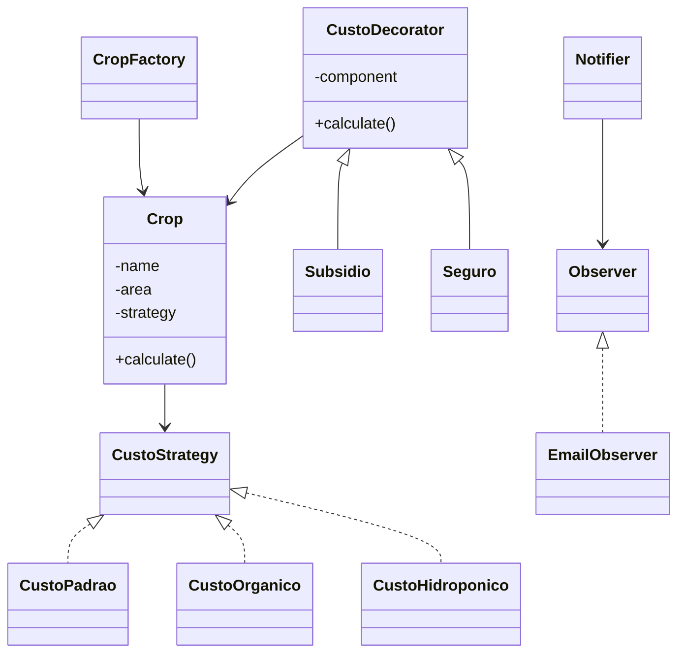

# Sistema de Produção Agrícola  
**Desenvolvido por:** Andrei Cardozo (andrei.cardozo@unidavi.edu.br)

Este projeto simula o planejamento de produção agrícola utilizando quatro padrões de projeto clássicos: **Strategy**, **Decorator**, **Factory Method** e **Observer**.  
O sistema calcula custos de produção de diferentes culturas, permite aplicar benefícios (subsídios/seguros), organiza a criação das culturas de forma centralizada e envia notificações ao usuário sempre que um cálculo é executado.

---

# 🧭 Problema do Domínio

No planejamento agrícola, o custo de produção depende de fatores como:

- Tipo da cultura (milho, soja, alface…)
- Método de produção (orgânico, padrão, hidropônico…)
- Benefícios aplicados (subsídios, seguros)
- Necessidade de acompanhar eventos importantes

O objetivo deste projeto é criar uma **arquitetura flexível, escalável e extensível**, mostrando como padrões de projeto resolvem problemas reais do domínio rural.

---

# 🧩 Padrões de Projeto Implementados

---

## 1️⃣ Strategy — Cálculo de Custo

Permite trocar a lógica de cálculo **dinamicamente**, sem mudar a estrutura do objeto.

**Classes:**
- `CustoStrategy` (interface)
- `CustoPadrao`
- `CustoOrganico`
- `CustoHidroponico`

**Por que usar?**  
Cada cultura pode ter seu custo calculado de forma diferente. A troca de estratégia em runtime é natural e mantém o sistema coeso.

---

## 2️⃣ Decorator — Benefícios (Subsidio + Seguro)

Permite adicionar funcionalidades sobre o cálculo base **sem criar classes gigantes**.

**Classes:**
- `CustoDecorator` (abstrata)
- `Subsidio`
- `Seguro`

**Por que usar?**  
Você pode empilhar benefícios:
- Só subsídio  
- Só seguro  
- Subsídio + seguro  
- Ou nenhum  

Tudo sem precisar criar “CulturaComSeguroESubsidio”.

---

## 3️⃣ Factory Method — Criação das Culturas

Centraliza a criação das culturas e atribui automaticamente a *Strategy* padrão.

**Classe:**
- `CropFactory`

**Por que usar?**  
Facilita a expansão. Se amanhã surgirem novas culturas, basta adicionar no factory sem quebrar o restante do sistema.

---

## 4️⃣ Observer — Notificações sobre Eventos

Usado para enviar avisos quando algum cálculo de custo é realizado.

**Classes:**
- `Observer` (interface)
- `Notifier` (Subject)
- `EmailObserver` (Observer concreto)

**Por que usar?**  
Se o sistema precisar notificar múltiplos interessados (e-mail, dashboard, log) basta registrá-los no Notifier.

---

# 🖥 CLI / Menu Inicial

O arquivo **index.php** funciona como ponto de entrada geral.

Ele mostra:

- Título do sistema
- Nome do desenvolvedor
- Links diretos para os 3 conjuntos de testes:
  - **Strategy/Decorator/Factory** (`test_all.php`)
  - **Observer** (`observer_test.php`)
  - **Test suite completa**

Além disso:

📌 **Se você alterar os valores de cálculo no backend, o sistema continua funcionando normalmente.**  
O CLI apenas organiza a navegação para o professor.

---

# 🗂 Estrutura de Pastas

agroproject/
│
├── domain/
├── strategies/
├── decorators/
├── factory/
├── observers/
├── tests/
├── README.md
└── index.php

Cada pasta representa um padrão, deixando o código organizado, limpo e fácil de navegar.

---

# 🌱 Diagrama Geral dos Padrões (Mermaid)

## ▶ Como Rodar o Projeto

Instale XAMPP.

Coloque o projeto em:

C:\xampp\htdocs\agroproject

Acesse no navegador:

Tela inicial (CLI):
http://localhost/agroproject/index.php

Testes principais:
http://localhost/agroproject/tests/test_all.php

Teste do Observer:
http://localhost/agroproject/tests/observer_test.php

📌 Todos os cálculos funcionam mesmo que você altere valores no back-end.

## 🧠 Decisões de Design

Cada padrão foi aplicado em uma área onde realmente faz sentido.

Uso claro de namespaces para evitar colisões.

Crop funciona como Context para a Strategy e como Component do Decorator.

Factory evita espalhar lógica de criação pelo código.

Observer adiciona reatividade ao sistema.

Organização modular facilita testes isolados.

## ⚠ Limitações

Não há uma interface completa para alterar valores via navegador (opcional no trabalho).

O sistema opera com valores fixos, sem variáveis de mercado reais.

Foco acadêmico: não há persistência em banco de dados.

## ✔ Conclusão

Este projeto demonstra, de forma clara e integrada ao domínio agrícola, como padrões clássicos de design tornam o sistema flexível, modular e extensível.
Cada padrão cumpre um papel específico e todos trabalham juntos para resolver problemas reais do contexto de produção agrícola.